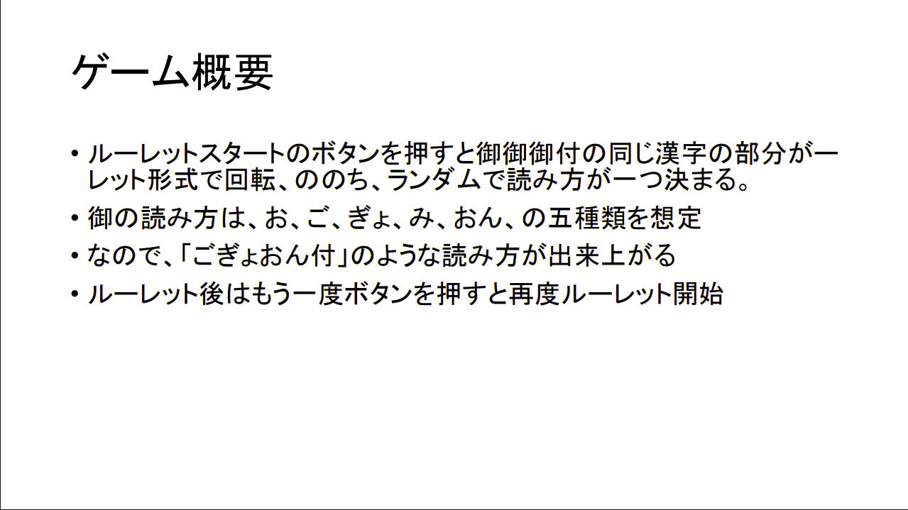
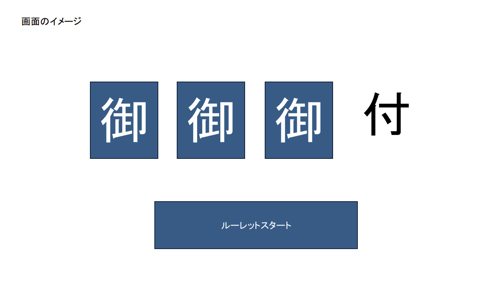

## 概要
御御御付（おみおつけ）の「御」の字の読み方をルーレット形式で決定するゲームを作りました。  
ユーモアとアニメーションを意識して開発しています。

## 画像

## 操作説明
スペースキーのみで行えます。  
ルーレット開始、各スロット停止を行えます。

## 実装環境
Unity6000.3.2f1

## 初期案

## 実装時のこだわり
ユーモアをとにかく大切にしています。できるだけコミカルに見せるため、テクスチャやUI、アニメーションにこだわっています。  
また、すぐ遊べる手軽さ、わかりやすく簡単な操作、見やすいビジュアルになるよう意識しています。

## 苦労したコト
アニメーションに関してしっかりと手を加えたことが無く、アニメーションのことを１から学びました。  
コミカルで手作り感のある見た目にするため、色遣いや文字の大きさなどを試行錯誤しました。

## 今後の展望
ルーレット結果をデカデカと表示してさらにコミカル感を演出したいと考えています。  
BGMや効果音も付け、しっかりと完成させ、Unityroomにて公開しようと考えています。

## お借りしたもの
  - [ニコカv2(フォント)](https://free-fonts.jp/nicoca-v2/)
